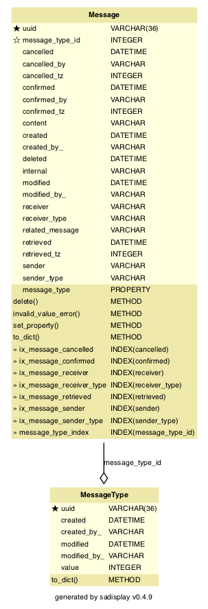

<!-- Title - A concise title for the service that fits the pattern identified and in use across all services. -->
# Polaris Messages API

[](https://github.com/ambv/black)

<!-- Description - Fewer than 500 words that describe what a service delivers, providing an informative, descriptive, and comprehensive overview of the value a service brings to the table. -->
The Messages API is part of the Polaris platform (formerly DHOS). This service allows messages to be sent between 
clinicians and patients.

## Maintainers
The Polaris platform was created by Sensyne Health Ltd., and has now been made open-source. As a result, some of the
instructions, setup and configuration will no longer be relevant to third party contributors. For example, some of
the libraries used may not be publicly available, or docker images may not be accessible externally. In addition, 
CICD pipelines may no longer function.

For now, Sensyne Health Ltd. and its employees are the maintainers of this repository.

## Setup
These setup instructions assume you are using out-of-the-box installations of:
- `pre-commit` (https://pre-commit.com/)
- `pyenv` (https://github.com/pyenv/pyenv)
- `poetry` (https://python-poetry.org/)

You can run the following commands locally:
```bash
make install  # Creates a virtual environment using pyenv and installs the dependencies using poetry
make lint  # Runs linting/quality tools including black, isort and mypy
make test  # Runs unit tests
```

You can also run the service locally using the script `run_local.sh`, or in dockerized form by running:
```bash
docker build . -t <tag>
docker run <tag>
```

## Documentation
<!-- Include links to any external documentation including relevant ADR documents.
     Insert API endpoints using markdown-swagger tags (and ensure the `make openapi` target keeps them up to date).
     -->

<!-- markdown-swagger -->
 Endpoint                                   | Method | Auth? | Description                                                                                                                                                                                                                    
 ------------------------------------------ | ------ | ----- | -------------------------------------------------------------------------------------------------------------------------------------------------------------------------------------------------------------------------------
 `/running`                                 | GET    | No    | Verifies that the service is running. Used for monitoring in kubernetes.                                                                                                                                                       
 `/version`                                 | GET    | No    | Get the version number, circleci build number, and git hash.                                                                                                                                                                   
 `/dhos/v1/patient/{patient_id}/activation` | POST   | Yes   | Create a new activation for a patient. Responds with a shortened URL and a one-time-pin, to be used once to validate the activation.                                                                                           
 `/dhos/v1/patient/{patient_id}/activation` | GET    | Yes   | Responds with a list of activations created for the specified patient UUID.                                                                                                                                                    
 `/dhos/v1/patient/{patient_id}/jwt`        | GET    | No    | Responds with a valid patient JWT. Requires the `x-authorisation-code` header containing an authorisation code acquired by validating a patient activation.                                                                    
 `/dhos/v1/clinician`                       | POST   | Yes   | Create a clinician object, only to be used for storing clinician login details. Not to be confused with the clinician object in DHOS Services API.                                                                             
 `/dhos/v1/clinician/{clinician_id}`        | PATCH  | Yes   | Update a clinician object, only to be used for storing clinician login details.                                                                                                                                                
 `/dhos/v1/clinician/jwt`                   | GET    | Yes   | Responds with a valid clinician JWT. Requires a device JWT for authorisation.                                                                                                                                                  
 `/dhos/v1/device`                          | POST   | Yes   | Create a known device containing details including location and name.                                                                                                                                                          
 `/dhos/v1/device`                          | GET    | Yes   | Responds with a list of known devices, containing details such as location and name.                                                                                                                                           
 `/dhos/v1/device/{device_id}`              | GET    | Yes   | Get details of the known device with the specified UUID.                                                                                                                                                                       
 `/dhos/v1/device/{device_id}`              | PATCH  | Yes   | Update details of the known device with the specified UUID.                                                                                                                                                                    
 `/dhos/v1/device/{device_id}/activation`   | POST   | Yes   | Create a new activation for a known device. Responds with an activation code, to be used once to validate the activation.                                                                                                      
 `/dhos/v1/device/{device_id}/jwt`          | GET    | No    | Responds with a valid device JWT. Requires the `x-authorisation-code` header containing a code acquired by validating a device activation.                                                                                     
 `/dhos/v1/activation/{activation_code}`    | POST   | No    | Validate ('activate') a previously-created activation for a patient or device. Requires the one-time-PIN (OTP) provided when the activation was created. Responds with a valid authorisation code to be used to retrieve a JWT.
<!-- /markdown-swagger -->

## Requirements
<!-- An outline of what other services, tooling, and libraries needed to make a service operate, providing a
  complete list of EVERYTHING required to work properly. -->
  At a minimum you require a system with Python 3.9. Tox 3.20 is required to run the unit tests, docker with docker-compose are required to run integration tests. See [Development environment setup](https://sensynehealth.atlassian.net/wiki/spaces/SPEN/pages/3193270/Development%2Benvironment%2Bsetup) for a more detailed list of tools that should be installed.
  
## Deployment
<!-- Setup - A step by step outline from start to finish of what is needed to setup and operate a service, providing as
  much detail as you possibly for any new user to be able to get up and running with a service. -->
  
  All development is done on a branch tagged with the relevant ticket identifier.
  Code may not be merged into develop unless it passes all CircleCI tests.
  :partly_sunny: After merging to develop tests will run again and if successful the code is built in a docker container and uploaded to our Azure container registry. It is then deployed to test environments controlled by Kubernetes.

## Testing
<!-- Testing - Providing details and instructions for mocking, monitoring, and testing a service, including any services or
  tools used, as well as links or reports that are part of active testing for a service. -->

### Unit tests
:microscope: Either use `make` or run `tox` directly.

<!-- markdown-make Makefile tox.ini -->
`tox` : Running `make test` or tox with no arguments runs `tox -e lint,py39`

`make clean` : Remove tox and pyenv virtual environments.

`make debug` (or `tox -e debug`) : Run last failing unit test and invoke debugger on errors

`make help` : Show this help.

`make lint` (or `tox -e lint`) : Run black, isort, and mypy to clean up source files

`make openapi` (or `tox -e openapi`) : Recreate API specification (openapi.yaml) from Flask blueprint

`make pyenv` : Create pyenv and install required packages (optional).

`make readme` (or `tox -e readme`) : Updates the README file with database diagram and commands. (Requires graphviz `dot` is installed)

`make test` : Test using `tox`

`make update` (or `tox -e update`) : Update poetry lock files

<!-- /markdown-make -->

## Integration tests
:nut_and_bolt: Integration tests are located in the `integration-tests` sub-directory. After changing into this directory you can run the following commands:

<!-- markdown-make integration-tests/Makefile -->
<!-- /markdown-make -->

## Issue tracker
:bug: Bugs related to this microservice should be raised on Jira as [PLAT-###](https://sensynehealth.atlassian.net/issues/?jql=project%20%3D%20PLAT%20AND%20component%20%3D%20Locations) tickets with the component set to Locations.

## Database migrations
Any changes affecting the database schema should be reflected in a database migration. Simple migrations may be created automatically:

```$ tox -e flask -- db migrate -m "some description"```

More complex migration may be handled by creating a migration file as above and editing it by hand.
Don't forget to include the reverse migration to downgrade a database.
  
## Configuration
<!-- Configuration - An outline of all configuration and environmental variables that can be adjusted or customized as part
  of service operations, including as much detail on default values, or options that would produce different known
  results for a service. -->
  * `DATABASE_USER, DATABASE_PASSWORD,
   DATABASE_NAME, DATABASE_HOST, DATABASE_PORT` configure the database connection.
  * `LOG_LEVEL=ERROR|WARN|INFO|DEBUG` sets the log level
  * `LOG_FORMAT=colour|plain|json` configure logging format. JSON is used for the running system but the others may be more useful during development.
  
## Database
Messages are stored in a Postgres database.

<!-- Rebuild this diagram with `make readme` -->


## Messages

Messages have the following fields:

- Identifiers (the usual Polaris set of UUID, Created, Modified, URI)
- Message Type (an enumerated object, details below)
- Content (free text)
- Sender UUID
- Sender type (e.g. "patient", "clinician", "location")
- Receiver UUID
- Receiver type (e.g. "patient", "clinician", "location")
- Retrieved (ISO8601 timestamp)
- Confirmed (ISO8601 timestamp)
- Confirmed by (a UUID)
- Related Message (a UUID)
- Cancelled (ISO8601 timestamp)
- Cancelled by (a UUID)

"Active" messages are any unconfirmed messages + confirmed callback messages.

## Message sender and receiver

The fields above contain information about who sent a Message, and who should receive it. The receiver and sender fields both contain UUIDs.

Messages can be sent/received by clinicians, patients, and even locations, so the UUIDs must be used in combination with the "sender type" and "receiver type" fields to identify the sender and receiver.

## Message state

A Message may go on many travels during its time within Polaris. The flow looks something like this:

 1. Created: timestamp at which Message is created and sent to the Polaris Messages microservice by the sender
 2. Modified: timestamp at which Message is modified by the sender
 3. Retrieved: timestamp at which Message is first retrieved from the microservice by the receiver
 4. Confirmed/Cancelled: timestamp at which Message is confirmed as having been read by the receiver, or a call back request is cancelled.

Some Messages may not require all of these steps; for example, some Messages may not require confirmation or cancellation.

A Message's state needs to be updated on the microservice by the various front-end clients. For example, after retrieving a Message from the microservice, a client should send an update (PATCH) to the microservice with a timestamp of the retrieval - we need full handshaking here, otherwise the microservice may think the Message has been retrieved when it hasn't.

Because messages cannot be edited, the only fields that can be updated via PATCH are the "retrieved", "confirmed", "confirmed by", "cancelled", and "cancelled by" fields.

## Message type

Messages must be one of a number of defined types. Because of the interfaces between various systems within the Drayson Health products, the types are defined by an integer value. In addition, the Message types each have a human-readable UUID (for ease of debugging and testing).

The various Message types are enumerated here, along with their associated integer values:

- DHOS-MESSAGES-GENERAL (value 0)
- DHOS-MESSAGES-DOSAGE (value 1)
- DHOS-MESSAGES-DIETARY (value 2)
- DHOS-MESSAGES-FEEDBACK (value 3)
- DHOS-MESSAGES-CALLBACK (value 5)
- DHOS-MESSAGES-ACTIVATION-CODE (value 6)
- DHOS-MESSAGES-RED-ALERT (value 7)
- DHOS-MESSAGES-AMBER-ALERT (value 8)
- DHOS-MESSAGES-GREY-ALERT (value 9)

**Note:** This list may change, grow or shrink, but **values associated with the different types should never be changed** as this would cause the front-end clients to display Messages erroneously (unless there is a corresponding change in values for each client).

## Authentication
It is the responsibility of the Polaris architecture to ensure that no client has access to Messages it is not authorised to see. For example, a clinician should not be allowed to retrieve Messages concerning a location with which they are not associated. Similarly, a patient should not be allowed to retrieve Messages concerning a different patient!
